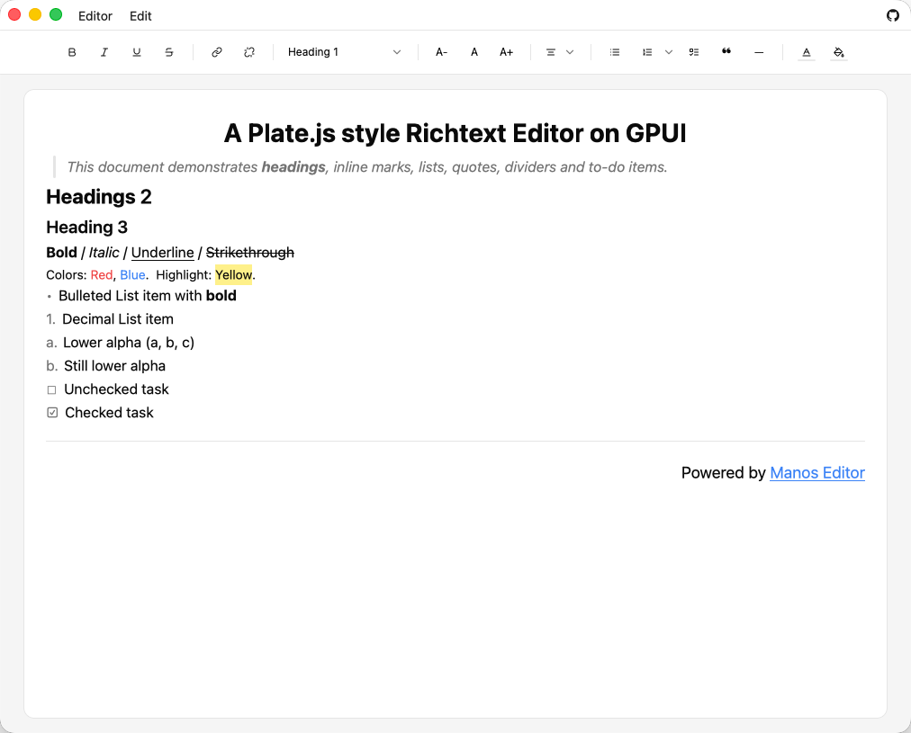

# Manos

> "A rich text editor built on `gpui` and `gpui-component`, inspired by `plate.js`."

This repository is intended to host additional GPUI components about a Richtext Editor built on top of `gpui` and
`gpui-component`.

## Run

- Story app: `cargo run`
- DnD list example: `cargo run --example dnd_list`
- DnD tree example: `cargo run --example dnd_tree`
- Rich text example: `cargo run --example richtext`
- Plate toolbar buttons: `cargo run --example plate_toolbar_buttons`
